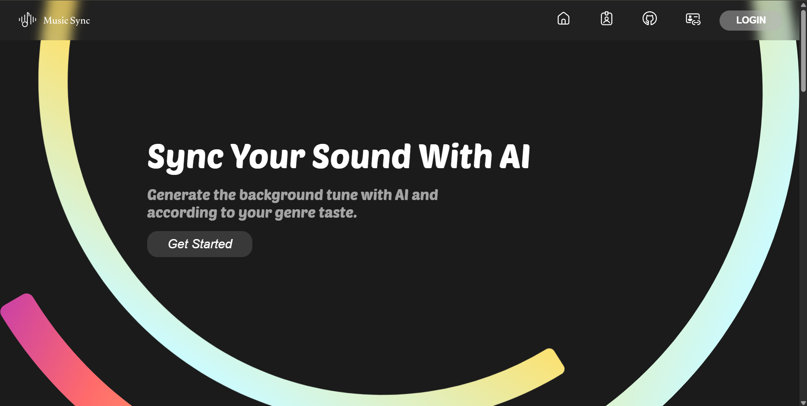
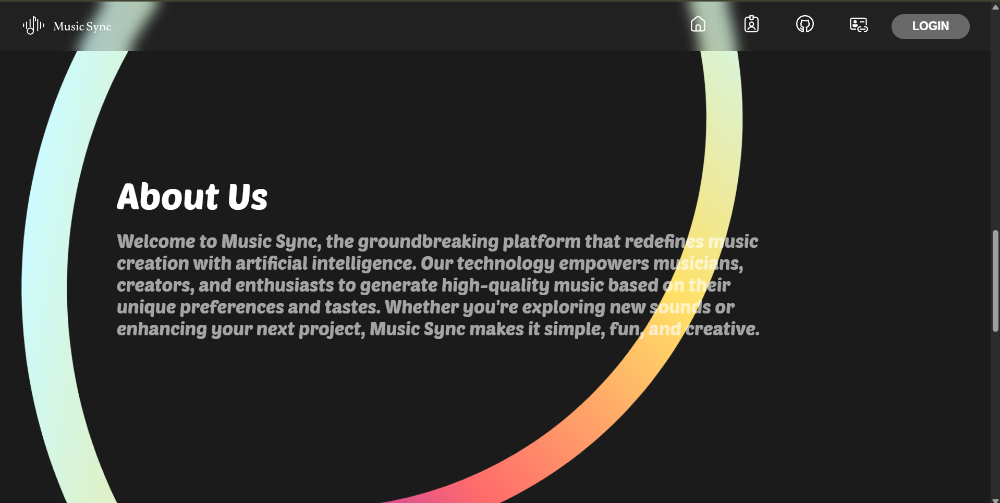
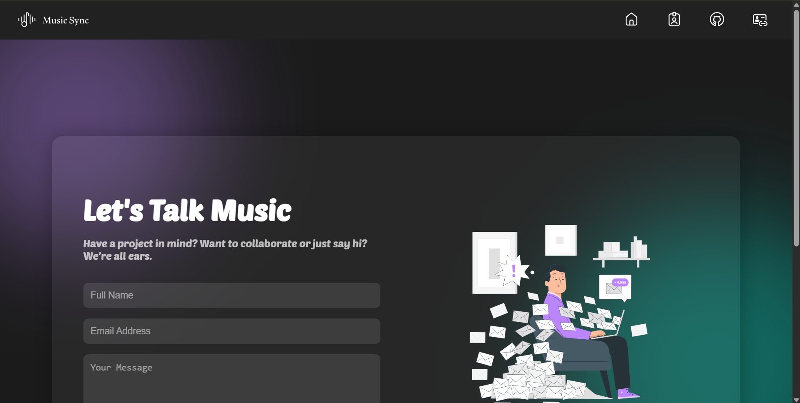
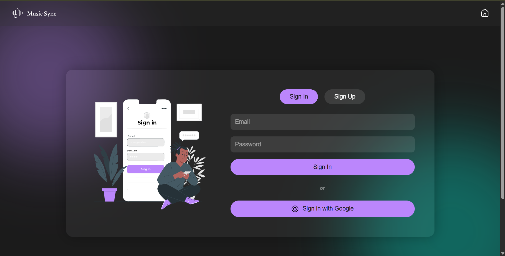
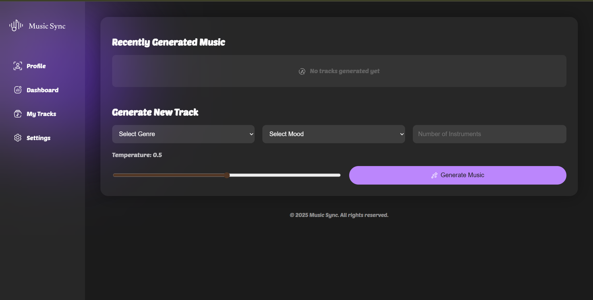

# 🎶 Music Sync – AI Music Generator

> *"Compose your creativity. Let AI orchestrate your imagination."*


---

## 📁 Table of Contents

* [🎮 Introduction](#-introduction)
* [🚀 Features](#-features)
* [🛠️ Technologies Used](#-technologies-used)
* [📦 Installation](#-installation)
* [🎮 Usage](#-usage)
* [🖼️ Screenshots](#-screenshots)
* [🤝 Contributing](#-contributing)
* [📜 License](#-license)

---

## 🎮 Introduction

**Music Sync** is an innovative web application that uses **artificial intelligence** to generate unique music tracks based on user preferences. Designed for musicians, hobbyists, and developers alike.

---

## 🚀 Features

| Feature                  | Description                        |
| ------------------------ | ---------------------------------- |
| 🎵 AI-Powered Generation | Create music using neural networks |
| 👤 User Authentication   | Secure login and registration      |
| 📊 Dashboard             | Visualize and manage your music    |
| 📂 Track Management      | Save and organize generated tracks |
| 📱 Responsive Design     | Optimized for all devices          |

---

## 🛠️ Technologies Used

| Layer        | Tech Stack                                                                                                                                                                                                                                                                                                                                                      |
| ------------ | --------------------------------------------------------------------------------------------------------------------------------------------------------------------------------------------------------------------------------------------------------------------------------------------------------------------------------------------------------------- |
| **Backend**  |     |
| **Frontend** |                                                                                                     |
| **Database** |                                                                                                                                                                                                                                                                              |

---

## 📦 Installation

Set up the project locally:

```bash
git clone https://github.com/vaibhav2067/Music-Generator-Using-Neural-Networks-MusicSync-.git
cd Music-Generator-Using-Neural-Networks-MusicSync-
python -m venv venv
# Activate virtual environment
source venv/bin/activate  # On Windows: venv\Scripts\activate
pip install -r requirements.txt
flask run
```

---

## 🎮 Usage

1. 🔐 **Sign Up / Log In**
2. 🎶 **Generate Music** using AI
3. 📋 **Manage Your Tracks**
4. ⚙️ **Adjust Profile Settings**

---

## 🖼️ Screenshots

| Page             | Preview                                         |
| ---------------- | ----------------------------------------------- |
| 🏠 **Home**      |             |
| ℹ️ **About**     |           |
| 📞 **Contact**   |       |
| 🔑 **Sign In**   |        |
| 📊 **Dashboard** |  |

---

## 🤝 Contributing

We welcome contributions from the community! Follow these steps:

```bash
1. Fork the repository
2. Create your feature branch (git checkout -b feature-name)
3. Commit your changes (git commit -m "Add something")
4. Push to the branch (git push origin feature-name)
5. Open a Pull Request 🚀
```

---

## 📜 License

This project is licensed under the **MIT License**.
See the [LICENSE](LICENSE) file for more details.

---

> Made with ❤️ by [Vaibhav2067](https://github.com/vaibhav2067)
